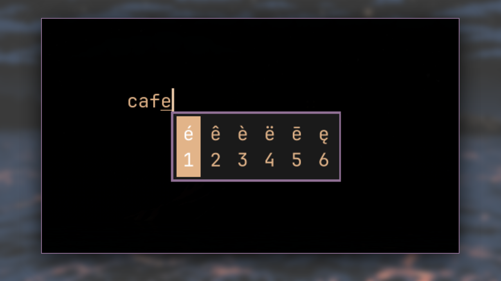
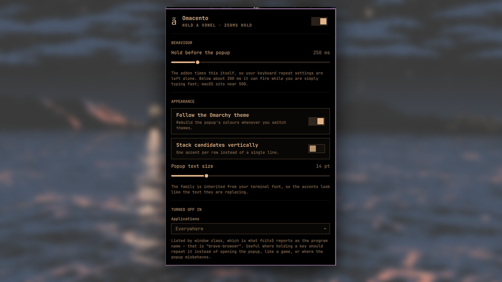

# Omacento

Press-and-hold accents for Omarchy, the way macOS does them: hold a vowel, a
popup opens at the text cursor with every accented form, and a digit or an
arrow picks one.



The digit sits under the character rather than beside it, the way macOS draws
it.

Nine accent sets — Português, Español, Français, Deutsch, Italiano, Polski,
Türkçe, Nordisk and English — picked from the panel. They differ in **order**,
not in reach: each one puts the accents that language actually uses on `1` and
`2`. Portuguese leads with `á ã â à`; French leads with `à â á ä`. The popup is
themed from the current Omarchy palette.

## What it actually is

A small **fcitx5 addon** written in C++, plus a bar widget to configure it.

The addon watches key events at `EventWatcherPhase::PreInputMethod`, so it sees
them before any input method engine and can consume them outright. Per input
context it runs a three-state machine:

| State | Event | What happens |
|---|---|---|
| idle | press of an accent-bearing key | consume it and start a timer — nothing is shown yet |
| pending | release before the timer | commit the plain letter — it was a tap |
| pending | a different key | commit the plain letter, then handle the new key normally |
| pending | timer fires | put the base letter in the **preedit** and show the candidates |
| picking | `1`–`9` | commit that accent |
| picking | `←` `→` `Tab` | move the selection |
| picking | `Enter` / `Space` | commit the highlighted one |
| picking | `Esc` / `Backspace` | commit the plain letter |
| picking | release of the held key | nothing — the popup outlives the release, as on macOS |

Three properties fall out of that design, and all three are the point:

**The hold time is its own timer.** Not your key repeat. fcitx5's built-in long
press has no timer at all — it fires on the first auto-repeat event, which
makes the popup delay and `input:repeat_delay` the same number. This addon
reads neither and writes neither.

**The base letter is never committed until you decide.** Once the popup is up
it lives in the preedit. So nothing ever has to be deleted afterwards, and
`deleteSurroundingText` — which Chromium silently drops on Wayland — is never
called. That is why accents work in Brave on native Wayland here, with no
XWayland, no wrapper script and no browser flags.

**Ordinary typing produces no composition at all.** A tap is one
`commit_string` and nothing else; the preedit only starts if the hold survives
the timer. An earlier version opened a composition on every keypress and
withdrew it on release, which is invisible in a terminal but made Google Docs
walk its caret backwards and scramble letters — it re-renders on every
composition cycle. Measured in a `contenteditable`: typing a sentence now fires
zero `compositionstart` and zero `delete*` input events, and a single held key
fires exactly one.

Because it lives inside fcitx5, it inherits every frontend fcitx5 already has:
Wayland (`text-input-v3`), XIM, GTK, Qt and D-Bus. Verified working in GTK4 on
Wayland, in Brave on native Wayland, and in an XWayland client.

## Installing

```bash
omarchy plugin add https://github.com/heroesofcode/omacento --enable
```

That is the whole thing. The widget's first run compiles the addon, installs it
under `~/.local`, and restarts fcitx5 so it gets picked up — about ten seconds,
once. Nothing needs root and nothing outside your home directory is touched.

The only requirement is a C++ compiler: `base-devel`, which Omarchy already
installs. If it is missing, `omacento-doctor` says so instead of failing
quietly.

Everything else the scripts reach for ships with Omarchy already: `python3`
(reading and writing the config and theme files), `hyprctl` (listing window
classes for the blocklist), `systemctl` (the fcitx5 user service), plus `awk`,
`sed` and `grep`. Nothing is fetched from the network at any point.

## Languages

Nine sets ship: Português, Español, Français, Deutsch, Italiano, Polski,
Türkçe, Nordisk and English (international). Pick one in the panel.

They differ in **order**, not in reach — every set can still get to the same
characters, further down the row. Order is what you actually feel, because the
first two land on `1` and `2`:

```
Português   á  ã  â  à  ä  å  ā  æ
Français    à  â  á  ä  ã  æ  å
Deutsch     ä  à  á  â  ã  å  æ
```

Only the lowercase half of a set is written down. The uppercase half is
derived, so adding a language cannot leave Shift half-working. That derivation
is not as simple as it looks: Latin Extended-A stores case pairs with the
uppercase on the even codepoint for most of the block and on the *odd* one for
two stretches of it, so a single parity rule handles `ć` and `š` correctly
while quietly leaving `ł`, `ź`, `ż` and `ž` alone — Polish breaks and nothing
else does. The ranges are spelled out in `addon/src/presets.cpp`, and the test
suite checks the ones that flip.

To go beyond the presets, set `Table` in
`~/.config/fcitx5/conf/omacento.conf` — one entry per key, the base character
then its variants, space separated, lowercase only:

```ini
[Table]
0=a á ã â à
1=ç ć č
```

A base character does not have to be ASCII: the lookup is on the character the
key produces, not on its keysym, so a layout whose key already yields `ç` can
hang more variants off it.

## Updating

```bash
omarchy plugin update io.github.heroesofcode.omacento
omarchy-restart-shell
```

The second line is not optional, and it is not specific to this plugin.
`omarchy plugin update` calls `rescanPlugins`, which does **not** re-read a
plugin's QML — measured by changing a label in both `Panel.qml` and `Model.js`
and watching the panel keep the old text until the shell was restarted. A
first-time install needs no restart, because there is no previously compiled
copy to go stale.

Note `omarchy-restart-shell`, not `omarchy-refresh-shell`: the latter resets
`shell.json` to Omarchy's defaults and takes every plugin off your bar.

The addon half looks after itself — `omacento-apply` restarts fcitx5 when it
installs a new build, so only the panel needs the shell restart.

## It is not an input method

It does not appear in your input method list and does not change your keyboard
layout. It is a *module* addon: it sits beside the engine you already use and
only reacts to a held key.

## Defaults



| Setting | Default | Notes |
|---|---|---|
| Enabled | on | right-clicking the bar icon toggles it |
| Accent set | Português | nine languages; changes the order, not the reach |
| Hold before the popup | 250 ms | its own timer; macOS sits near 500 |
| Stack candidates vertically | off | one row by default |
| Popup text size | 14 | fcitx5's stock 10 is small next to a terminal |
| Popup font family | inherit | empty means the terminal's family |
| Follow the Omarchy theme | on | regenerates on theme and font changes |
| Turned off in | — | window classes where a held key just repeats |

## Using it

Hold a vowel. Pick with `1`–`9`, or walk the list with `←` / `→` / `Tab` and
press `Enter`. `Esc` keeps the plain letter. Tapping the key normally types the
plain letter, as always.

The bar icon opens the panel; right-clicking it toggles the whole thing off.

## From a terminal

```bash
omacento-apply '{"holdTime":400}'   # change one setting
omacento-apply --print              # show what would be written
omacento-doctor                     # check every layer, name the broken one
omacento-build                      # rebuild the addon if fcitx5 changed
omacento-build --check              # report only
omacento-apps                       # window classes, for the blocklist
```

## What it writes

Everything goes through `omacento-apply`, which is the only writer, so the
panel and the CLI cannot disagree.

| Path | What |
|---|---|
| `~/.config/fcitx5/conf/omacento.conf` | hold time, blocklist, accent table |
| `~/.config/fcitx5/conf/classicui.conf` | popup font, theme, orientation |
| `~/.local/share/fcitx5/themes/omacento/` | the generated theme |
| `~/.local/lib/fcitx5/libomacento.so` | the compiled addon |
| `~/.local/share/fcitx5/addon/omacento.conf` | addon metadata |
| `~/.local/state/omacento/appearance.json` | so the theme hooks can run alone |
| `~/.config/omarchy/hooks/{theme-set,font-set}.d/50-omacento` | theme sync |
| `~/.config/systemd/user/omarchy-fcitx5.service.d/10-omacento-addon.conf` | addon search path and rebuild |

It deliberately writes **nothing** under `~/.config/hypr`.

## Tests

```bash
make -C addon test
```

This loads the freshly built `libomacento.so` into a real fcitx5 `Instance`
alongside fcitx5's own `TestFrontend`, sends key events, and checks what comes
back out. Ten cases: tap, hold-and-pick, arrow-and-Enter, `Esc`, flush by a
second key, the uppercase table, `Ctrl+A` staying untouched, the blocklist, a
digit past the end of the list, and the off switch.

Two independent checks run at once. `pushCommitExpectation` aborts at the exact
commit that goes wrong, which is where the useful stack trace is; and the test
records every commit itself and compares the whole sequence at the end, because
the first check cannot see a commit that never happens — an addon that committed
nothing would otherwise pass with every expectation still queued.

The waits are against the addon's real timer, so the margins are deliberately
wide (a 20 ms tap against a 300 ms hold). An earlier 3x margin failed about one
run in five on a busy machine: the tap slipped past the threshold, became a
hold, and threw every later expectation off by one.

## Releasing

Versions are not edited by hand. release-please watches `main`, reads the
commit messages, and keeps a release pull request open with the next version
number and a generated `CHANGELOG.md`. Merging that PR tags the release and
publishes it.

So commit messages decide the version, and they follow
[Conventional Commits](https://www.conventionalcommits.org):

| Prefix | Effect |
|---|---|
| `fix:` | patch bump — 1.0.0 to 1.0.1 |
| `feat:` | minor bump — 1.0.0 to 1.1.0 |
| `feat!:` or a `BREAKING CHANGE:` footer | major bump — 1.0.0 to 2.0.0 |
| `refactor:` `perf:` | patch bump, shown in the changelog |
| `docs:` `ci:` `test:` `chore:` | no bump, not in the changelog |

`manifest.json` is bumped by release-please through the `extra-files` rule in
`release-please-config.json`; `.release-please-manifest.json` is where it
remembers the current version. Neither is meant to be edited by hand.

One thing to watch, with a caveat. GitHub documents that a pull request opened
with the default `GITHUB_TOKEN` does not trigger other workflows, which would
leave the release PR without the `test` check that `main` requires. **That did
not happen here**: on the 1.1.0 release PR, opened by `github-actions` with no
PAT configured, `test` ran four seconds later and the PR was mergeable. So do
not go looking for the problem — but if a release PR ever does show up with no
check, close and reopen it once and the check runs, because that is a human
action. A fine-grained PAT in a `RELEASE_PLEASE_TOKEN` secret also avoids it;
the workflow prefers that secret when present.

Pull requests are merged with **rebase**, so every commit message lands on
`main` verbatim and every one of them is parsed. A stray `wip` commit in a
branch becomes a stray `wip` commit in the history — squash locally first, or
switch the repository to squash-merge so only the PR title counts.

## Things that are true and not obvious

**fcitx5 only searches `/usr/lib/fcitx5` for addons.** `StandardPathsType::Addon`
has no user directory at all, unlike every other path type. The escape hatch is
`FCITX_ADDON_DIRS` — but it *replaces* the default list rather than extending
it, so the system directory has to be named in it too, or `xim`, `waylandim`
and `classicui` vanish along with it. That is the whole reason for the systemd
drop-in.

**An addon is tied to the fcitx5 it was built against.** The `Version=` field in
`omacento.conf` must match, or fcitx5 refuses to load it — silently, from the
user's point of view. `omacento-build` runs as `ExecStartPre` of
`omarchy-fcitx5.service`, so an upgrade heals on the next start instead of
turning into a bug report.

**The blocklist matches the window class, not the process name.** fcitx5
reports Brave as `brave-browser`, not `brave`. `omacento-apps` reads Hyprland's
`initialClass` for exactly this reason.

**Chromium drops `delete_surrounding_text` on Wayland.** Measured through the
DevTools protocol: the call arrives and nothing happens, no error. Any design
that commits a letter and then removes it produces `aá` in Brave. This one
never commits early, so it never finds out.

**A terminal is useless as a diagnostic instrument.** A pty does not process
deletion, so `cat > file` records what was emitted and never shows a retraction.
`wtype` types through the virtual-keyboard protocol and can hold a key with
`-P key -s 700 -p key`, which is enough to drive the timer — but only a real
text field that logs every buffer change shows what actually happened.

**Build dependencies are deliberately just `base-devel`.** A single shared
object does not need cmake, ninja and extra-cmake-modules; a plain `Makefile`
with `pkg-config` keeps three packages out of the way of anyone installing
this.

## Uninstall

```bash
omarchy plugin disable io.github.heroesofcode.omacento
make -C ~/.config/omarchy/plugins/io.github.heroesofcode.omacento/addon uninstall
rm -f ~/.config/fcitx5/conf/omacento.conf
rm -f ~/.config/omarchy/hooks/theme-set.d/50-omacento
rm -f ~/.config/omarchy/hooks/font-set.d/50-omacento
rm -rf ~/.local/share/fcitx5/themes/omacento
rm -rf ~/.local/state/omacento
rm -f ~/.config/systemd/user/omarchy-fcitx5.service.d/10-omacento-addon.conf
systemctl --user daemon-reload
systemctl --user restart omarchy-fcitx5
```

`~/.config/fcitx5/conf/classicui.conf` is left alone: fcitx5 owns that file and
Omacento only edits the theme, font and orientation lines in it.
